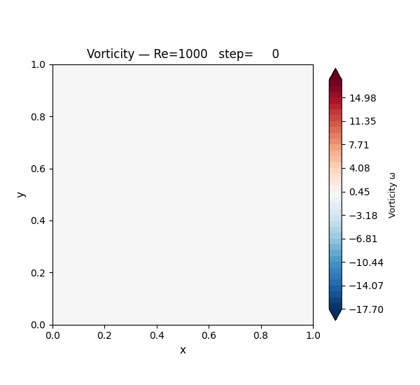
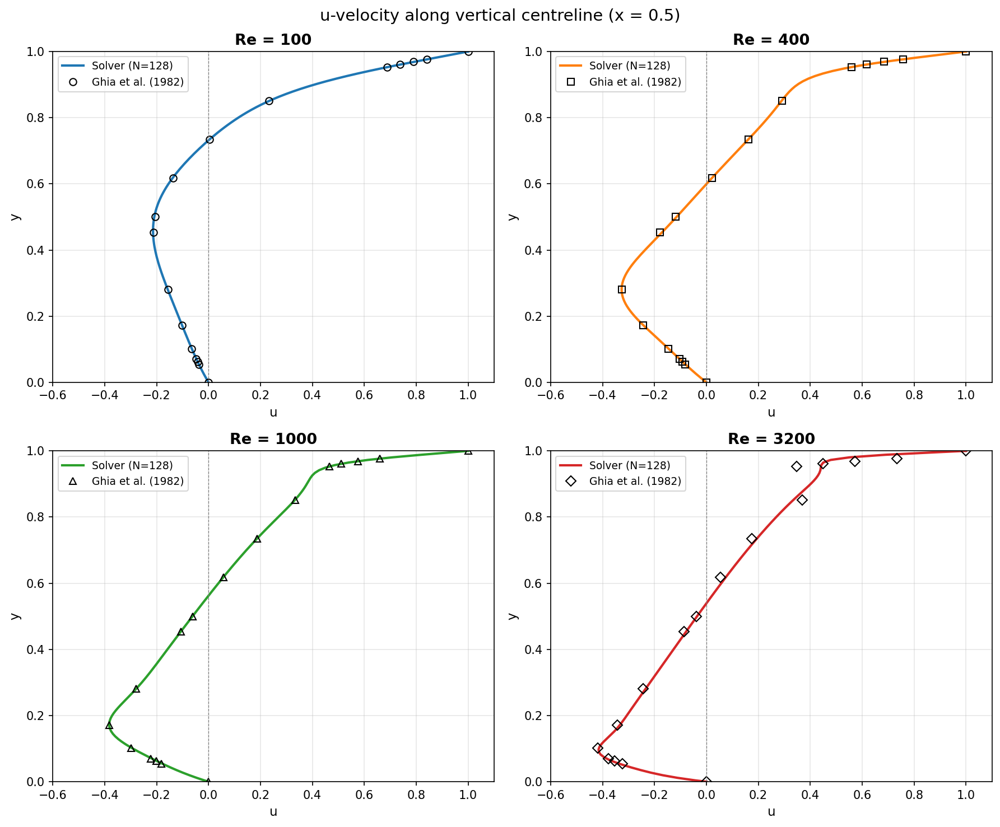
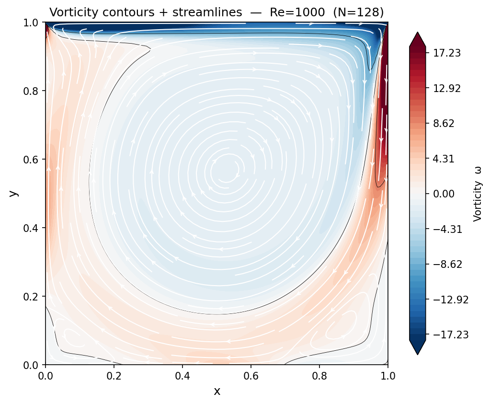
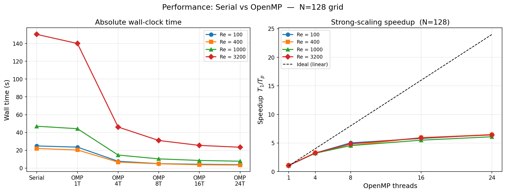
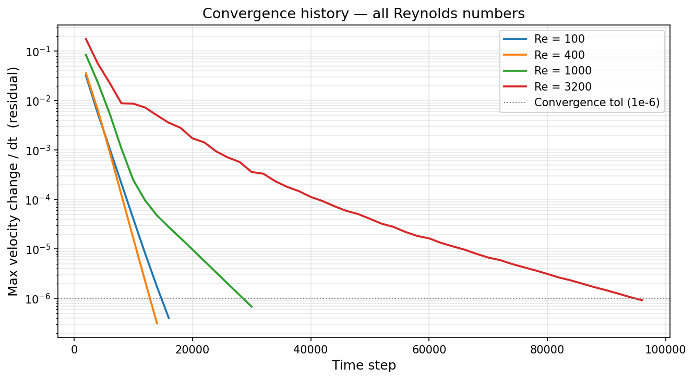

# Lid-Driven Cavity Flow — Serial & OpenMP Parallel Solver

> 2D incompressible Navier–Stokes solver in **Fortran 90** with **OpenMP** parallelism,
> validated against the Ghia et al. (1982) benchmark.

---

## Flow Animation — Re = 1000



*Vorticity field evolving from rest to steady state at Re = 1000 on a 128×128 grid.
Blue = negative vorticity (clockwise); Red = positive (counter-clockwise).
The primary lid-driven vortex forms and the lower-corner eddies develop as the flow settles.*

---

## Overview

The **lid-driven cavity** is a canonical CFD benchmark: a square cavity filled with
viscous fluid whose top wall moves at unit velocity while the other three walls are
stationary. This project implements a high-order finite-difference solver using the
**vorticity–stream-function formulation** and studies both flow physics and parallel
performance.

| Feature | Detail |
|---------|--------|
| Formulation | Vorticity – stream function |
| Spatial scheme | 2nd-order central differences |
| Time advance | Forward Euler (steady-state iteration) |
| Poisson solver | SOR (successive over-relaxation) |
| Grid | 128 × 128 (serial/OMP) · 64 × 64 (weak-scaling baseline) |
| Parallelism | OpenMP shared-memory (up to 24 threads tested) |
| Validation | Ghia et al. (1982) centreline velocity profiles |
| Language | Fortran 90 + Python 3 (post-processing) |

---

## Results at a Glance

### Validation vs Ghia et al. (1982)

| Re | Converged step | L∞ error |
|----|---------------|----------|
| 100 | 16 000 | 4.93 × 10⁻³ |
| 400 | 14 000 | 7.77 × 10⁻³ |
| 1 000 | 30 000 | 3.01 × 10⁻³ |
| 3 200 | 96 000 | 2.17 × 10⁻¹ |

### Strong-Scaling Speedup (N = 128, Re = 1000)

| Threads | Wall time (s) | Speedup | Efficiency |
|---------|-------------|---------|------------|
| 1  | 23.53 | 1.00× | 100% |
| 2  | 12.40 | 1.90× | 95%  |
| 4  |  7.67 | 3.07× | 77%  |
| 8  |  4.95 | 4.75× | 59%  |
| 16 |  4.29 | 5.49× | 34%  |
| 24 |  7.72 | 6.09× | 25%  |

Amdahl serial fraction: **f ≈ 12 %** — bottleneck is the SOR convergence check.

### Weak Scaling (N²/threads = const)

| Config | Wall time | Efficiency |
|--------|-----------|------------|
| N=64, 1 thread | 8.09 s | baseline |
| N=128, 4 threads | 7.72 s | **104.8 %** ✓ |

---

## Key Plots

| u-velocity profiles | Vorticity + Streamlines |
|---|---|
|  |  |

| Strong-scaling speedup | Convergence history |
|---|---|
|  |  |

---

## Repository Structure

```
.
├── src/                    # Fortran 90 source files
│   ├── solver_serial.f90   #   Serial solver  (N=128)
│   ├── solver_omp.f90      #   OpenMP solver  (N=128)
│   ├── solver_omp_n64.f90  #   OpenMP solver  (N=64, weak-scaling)
│   └── fft_dct.f90         #   Pure-Fortran FFT/DCT module
│
├── scripts/                # Python post-processing
│   ├── plot_results.py     #   Full plot suite (PNG previews)
│   ├── plot_paper.py       #   Paper-ready PDF figures (latexify)
│   └── latexify.py         #   Matplotlib RC helper for IEEE sizing
│
├── paper/                  # IEEE 2-column LaTeX paper
│   ├── main.tex
│   └── references.bib
│
├── results/                # Simulation output (CSV)
│   ├── benchmark_summary.csv
│   ├── timing_omp_t*.csv   #   Per-thread timing files
│   ├── field_Re*.csv       #   2D flow fields
│   ├── ghia_compare_Re*.csv#   Validation data
│   └── ...
│
├── plots/                  # PNG previews + GIF animation
│   └── animation_Re1000.gif
│
├── figs/                   # Paper-ready PDF figures
│   └── fig_*.pdf
│
├── Makefile                # Build all three solvers
└── build_and_run.sh        # One-shot build + run + plot script
```

---

## Quick Start

### Requirements

- `gfortran` (Fortran 90 compiler)
- `python3` with `numpy`, `matplotlib`, `scipy`, `Pillow`

Install on Ubuntu/WSL:
```bash
sudo apt install gfortran
pip install numpy matplotlib scipy Pillow
```

### Build & Run Everything

```bash
git clone https://github.com/<your-username>/HPSC-LidDrivenCavity.git
cd HPSC-LidDrivenCavity
bash build_and_run.sh
```

This will compile all solvers, run serial and OpenMP simulations for
Re = 100, 400, 1000, 3200, and generate all plots including the animation.

### Manual Steps

```bash
# Build
make all

# Run serial solver
./solver_serial

# Run OpenMP solver (adjust thread count as needed)
OMP_NUM_THREADS=8 ./solver_omp

# Weak-scaling baseline (N=64)
OMP_NUM_THREADS=1 ./solver_n64

# Generate all PNG plots + animation
python3 scripts/plot_results.py

# Generate paper-ready PDF figures
python3 scripts/plot_paper.py
```

---

## Paper

A full IEEE 2-column conference paper is in `paper/main.tex`.
To compile on [Overleaf](https://overleaf.com):
1. Upload `paper/main.tex`, `paper/references.bib`, and the entire `figs/` folder
2. Set compiler to **pdfLaTeX**
3. Click Compile

---

## References

- U. Ghia, K. N. Ghia, C. T. Shin, *"High-Re solutions for incompressible flow using
  the Navier–Stokes equations and a multigrid method"*, J. Comput. Phys. 48 (1982) 387–411.
- G. M. Amdahl, *"Validity of the single processor approach"*, AFIPS (1967).
- OpenMP Architecture Review Board, *OpenMP API Specification v5.2* (2021).

---

## License

MIT © Prady
